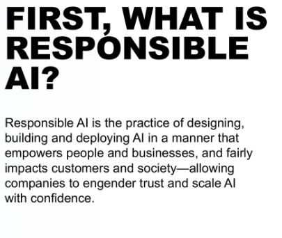

# AI Ethics Brainstorm

### Key Resources

* [Existing AI Ethics lesson plan](https://levelbuilder-studio.code.org/s/how-ai-works-2023/lessons/7)
* [Previous Feedback on AI Ethics lesson plan](https://docs.google.com/document/d/1TITaXY6jvzwlyJ3LeY2HwU8QpVMzRlCKLOTiLRRZTrg/edit#heading=h.6p63fc4jj127)

### Feedback from another person

For Code of Ethics

* Agilemanifesto.org
* “Why do we create manifestos? In response to something that has gone wrong”
* Holstee Manifesto; Deloitte 6 pillars of trustworthy AI; IBM Everyday Ethics for AI; ACM CS Code of Ethics;
  * “What are professions that have a code of ethics?” We think physicians, but also CS and Engineering, etc/
  * acm.org/code-of-ethics&#x20;
* Ways to think about the world; apply ethics to them
* Charlotte
* Personal manifesto; editing each other’s draft
* Manifestos involve graphic design
* “Use or be proud that you made”

### Meeting

* Goal: demonstrate understanding of ethical considerations around AI
* What if your code of ethics works well for your item, but not for others
  * ex: content moderation - "treat everyone equal" - but doesn't work in certain areas
    * Do articles include a potential "fix"? Can they reflect on how well the fix worked?
    * Instead of just sharing code of ethics
  * Could we frame around potential ethical statements and try to discuss places it works and places it doesn't
* Could we "poke at" things folks come up with
  * Can we do a little critiquing
* Could we present a Google or Microsoft code of ethics - ask if it was applied to their area?
  * Can we make it a generic code of ethics rather than highlighting these folks?
  * "How does this statement apply to the topic you researched today?"
    * Did your technology violate that? In what way?
    * Did your technology follow this tenant? In what way? Or if not: what change would you make to have it follow?
* Yim Formula:
  * \[Y] can be used for BLAH. It can
* Wrap up: here is this quote (Ruha Benjamin) - respond to it; how could you imagine the society you want to live in?
  * Ruha Benjamin: remember to imagine and craft the worlds you cannot live without, just as you dismantle the ones you cannot live within.
  * What does your AI world value?
  * Draw your imagined world and what it values
* [Research Areas Brainstorm](https://docs.google.com/presentation/d/1KuFjDWHLvaTt0IEk-Ja\_X4eu9d\_7Z1uWzOqWHxDi6ms/edit#slide=id.g27658d5587d\_0\_484)
* After research: need to talk to other groups
  * Write the headline of what they learned - write the clickbaity headline
* How do you get perspective on other technologies?
  * Jigsaw-esque activity?
  * How can students get a feeling for the complexities of these technologies that can inform the bigger product they will make at the end of the lesson?
    * They need to hear from other groups

### Activity Brainstorm

* (Yim) Warm Up
  * <mark style="background-color:green;">???</mark>
* Activity
  * (Yim) Research Areas (new format)
  * (Yim) Research Reflection (new questions)
  * <mark style="background-color:green;">(Dan/Yim - low stakes) UNKNOWN: Group share out / get perspective from others</mark>
  * (Dan) Options for student product
    * (Dan) Code of Ethics
      * quote
    * (Dan) Imagine your World + Gallery Walk
      * Include Ruha Benjamin Quote
    * (Dan) Manifesto
    * (Dan) Headline + Article
    * (Dan) Infographic
    * (Dan) "Write your legislator"?
* Wrap Up
  * Ruha Benjamin quote
  * Write about your imagined world with technology

### Resource 

* [\[Yim Updates\] Research Areas](https://docs.google.com/document/d/1ShgOKwwTFqxSQfZeB3uY4rQ3MGZfYmFwIpLy8P2\_R2I/edit)
* Ethics Frameworks
  * [https://www.scu.edu/ethics/ethics-resources/a-framework-for-ethical-decision-making/](https://www.scu.edu/ethics/ethics-resources/a-framework-for-ethical-decision-making/)
  * [https://www.designethically.com/framework2](https://www.designethically.com/framework2)
  * Confucian tech ethics: [https://www.sciencedirect.com/science/article/abs/pii/S0160791X20306151](https://www.sciencedirect.com/science/article/abs/pii/S0160791X20306151)
  * Accenture guide to making ethics: [https://accenture.pagetiger.com/aigovernanceguide](https://accenture.pagetiger.com/aigovernanceguide)
* Empathy questions: [https://static1.squarespace.com/static/5e37fdff744ec95bb01b2d78/t/5ea16e5ef09f7c126e43b392/1587637871092/ethics-litmus-tests-web.pdf](https://static1.squarespace.com/static/5e37fdff744ec95bb01b2d78/t/5ea16e5ef09f7c126e43b392/1587637871092/ethics-litmus-tests-web.pdf)

**SARAH IDEAS:**

* Introducing ethical frameworks
  * Ask the students an ethical question, have them answer and give their reasons. Possibly provide some possibilities for the students to pick from that are from different ethical frameworks for students to explain why they like or dislike.
  * Elisabeth provides students with thoroughly ridiculous things that follow a given ethical framework (turning in people to the Nazis so you don't lie, for example, though we wouldn't have to go that far) and they talk about ethical frameworks from there. Possibly also the reverse "This is a good idea, but it _doesn't_ follow a particular ethical framework, though it probably follows at least one.
    * Could also provide 1-2 sentence descriptions of ethical frameworks and allow students to come up with the wildest "This is a really bad idea" thing for that ethical framework as well?
* Introducing AI Ethics issues in particular
  * Long for a warmup, but I started the AI4ALL ethics module with AI Essay Autograders&#x20;
    * We can possibly make a mockup that they can put essays into and see how it grades them?&#x20;
    * We can show some graded essays from AI, and ask what the problem is
  * Create an Ethical Matrix for a piece of software
    * Who are the stakeholders? What are their values?
  * Complete one of the activities from[ DesignEthically](https://www.designethically.com/toolkit) for a pre-existing piece of software that the students know. We would have to provide some particular examples.
    * I particularly like the primary, secondary, and tertiary effects
  * "What is Fair?"
    * Basically - this [`slide`](https://docs.google.com/presentation/d/1GiwM0q61pGiKJIPQztlmC2eUZxu55bENzpiBkxOnu38/edit#slide=id.g9807dad14d\_0\_14)
* Grounding in empathy&#x20;
  * What does empathy mean to you? Where might it be important to use empathy in creating technology?
    * Relatedly: is empathy required in order to behave ethically?

#### Discussion Notes - Sarah's Ideas

* Can we think proactively about what you value? And how that defines what your ethics are?
* Start by asking an ethical question - have discussion
  * This way of thinking is Aristotelian... this way is \[X]... this way is \[Y]...
* Responsible AI?
  * 
* Google PAIR - fairness metrics
  * [https://pair.withgoogle.com/explorables/](https://pair.withgoogle.com/explorables/)
* "Would have liked to be exposed to different ethical views"

Dan thoughts

* Do we need to ground the start of this lesson in ethics at all? Or, with the switch to different options, do we even need to have such a heavy intro to ethics in the beginning?
  * Does this also align to the struggles with finding articles?

Yim Thought:

* Since the end-goal is Ruha Benjamin quote - ""Remember to imagine and craft the worlds you cannot live without, just as you dismantle the ones you cannot live within"
* <mark style="background-color:green;">\[Warm Up Option] Can you imagine a technology can empower you towards your passion?</mark>
  * Can you imagine a way AI can aid with something you are passionate about?
  * \[Is there a way to also lead with the unintended consequences?]

Sarah:

* <mark style="background-color:green;">\[Warm Up Option] Here is a piece of tech. What do you notice? What do you wonder?</mark>
  * Explicit example based off of what they will do in the activity - example of positive impact, example of unintended impact
  * Can be non-AI example, because then will apply to AI

<mark style="background-color:orange;">Can we bring this out in the reflection question? Can we bring out what fairness is here?</mark>

* [https://shubhamjain0594.github.io/post/tlds-arvind-fairness-definitions/](https://shubhamjain0594.github.io/post/tlds-arvind-fairness-definitions/)
* "Here are a few different ways of thinking of fairness. Here are a few different ethical theories / frameworks."
* "Pick one to include in your response"

**Reflection Design**

* Give example of ethical frameworks

* **Virtue ethics** : What is moral is what makes us the best person we could be.
* **Deontology** : What is moral is what follows from absolute moral duties.
* **Utilitarianism** : What is morally right is what generates the best outcome for the largest number of people.
* **Rights-based Ethics** : What is moral is that which is in accord with everyone's rights.
* **Care-based Ethics** : What is moral is that which promotes healthy relationships and the well-being of individuals and their interdependence.

* Give example of fairness metrics
* "Which of these seems to align most with how you are thinking about the impacts of this technology?"

.png>)

## Warm Up Option 1 (5 minutes) 

**Prompt:** Think about a hobby you're interested in or an issue you're passionate about. What's a piece of technology that doesn't exist yet, but could have a positive impact on this hobby or interest?

**Circulate:** Encourage students to take their time answering this prompt. You can prompt them to consider topics they are interested in, then encourage them to think freely and openly about something they wish existed that would have a positive impact. If students are stuck, consider asking:

* What are some barriers for people new to this topic? How could technology help get around those barriers?
* What is a big problem involving this topic? How could technology help solve this problem?
* What's your favorite thing about this topic? How could technology help make it even better, or help others enjoy it too?

**Discussion Goal:** Have a few students share their topic and their imagined piece of technology. There is no right or wrong answer to this prompt - instead, try to surface a wide variety of ideas.

**Display**: Show the slide with the following quote on it: "Remember to imagine and craft the worlds you cannot live without, just as you dismantle the ones you cannot live within" - Dr Ruha Benjamin

> :microphone2: _**Remarks**_
>
> This quote is from Dr Ruha Benjamin, a social scientist who focuses on the impact of technology on society. The warm-up was inspired by the first part of this quote - imagining ways technology can improve the world around us. But in the second part of the quote, it's also important to be realistic and acknowledge the ways technology can have unexpected or even harmful impacts on society. In today's lesson, we're going to explore both the uplifting and problematic aspects of one technology in particular: Artificial Intelligence.

* DO you think net impact of this technology is beneficial or harmful? why?
  * What would one of these frameworks say?

* Chart with description
  * Pick one of the frameworks. Do you think this technology is good / bad? Why?
